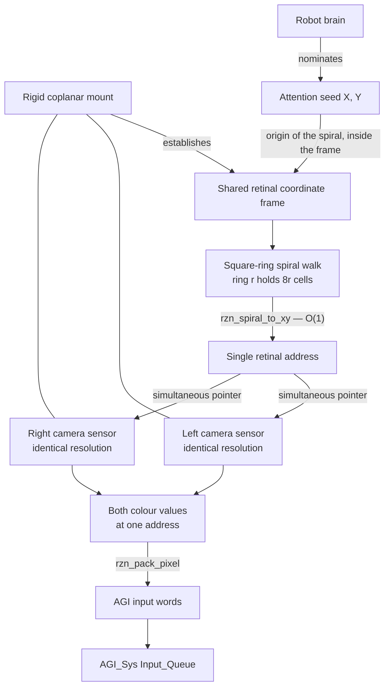
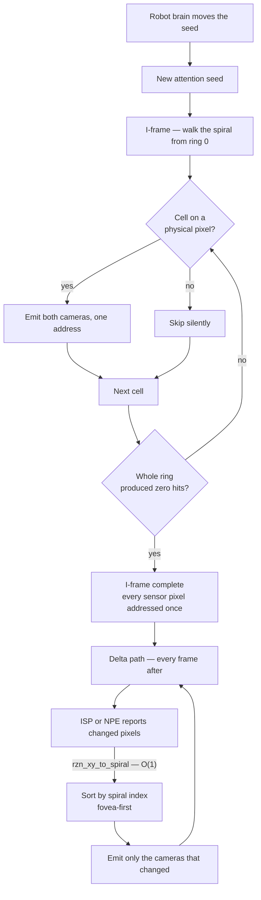

# Robot Stereo Vision

### RZN AI — Foveal Spiral Stereo Input Engine

Reference implementation in C11. Property of RZN AI.

Feeds a stereo camera pair into the RZN AI AGI model
([bcroner/RZNAI_AGI](https://github.com/bcroner/RZNAI_AGI)) using an
attention-centred spiral address space and event-driven delta updates.
Targets the Festivitly robots and Grab A Bot.

No external dependencies. Integer arithmetic only — no floating point anywhere
in the address path, so the mapping is bit-exact and reproducible across
compilers and targets (verified identical under GCC 14.2 and MSVC 14.51).

---

## The design

Two cameras of **identical resolution**, rigidly mounted coplanar and side by
side, share one retinal coordinate frame. That shared frame is what makes the
whole scheme work: a single address reaches both cameras at once.

**1. The seed.** The robot brain nominates an attention point (X, Y).

**2. The I-frame.** From the seed the engine walks an expanding square-ring
spiral. Step +X by one; then down; then left; then up; then right — closing
ring 1 and stepping +X into ring 2, and so on. At every cell that lands on a
physically present pixel it feeds the AGI the colour values from **both**
cameras at that one address. Cells that fall outside the sensor are skipped
silently. When an entire ring produces no physically present pixel, the I-frame
is complete.

**3. Deltas, forever after.** An ISP or Neural Processing Engine reports which
pixels changed. Only those addresses are re-fed, ordered fovea-first.

### The address model

The rig establishes one coordinate frame; the seed picks the spiral's origin
inside it. A single retinal address then reaches both cameras at once — that is
the whole trick, and everything downstream follows from it.



### The frame lifecycle

The spiral runs once to build the I-frame, then never again unless attention
moves. After that the engine is event-driven.



### Ring arithmetic

```
ring 0      1 cell    (the seed)
ring r    8*r cells   (r >= 1)
rings 0..r-1 together   (2r-1)^2 cells
box through ring r      (2r+1)^2 cells
```

Perimeters run 1, 8, 16, 24, 32, … — arithmetic (+8), not geometric. The
1 → 8 → 16 opening looks like doubling, but it stops there; ring 3 is 24, not
32. Buffer sizing depends on this.

### Termination is provably correct

Scanning until the first empty ring is sound, not heuristic. The rings are
nested squares and the sensor is a convex rectangle containing the seed, so
once a ring clears the sensor, every larger ring does too. The exact bound is

```
r_max = max(cx, W-1-cx, cy, H-1-cy)
```

Ring `r_max` always still holds at least one pixel; ring `r_max + 1` is always
empty. Verified exhaustively over seed positions across the sensor
(`test_termination`).

### Both directions are O(1)

`rzn_spiral_to_xy()` and `rzn_xy_to_spiral()` are closed-form. Nothing
searches or iterates over the image. This is what makes the delta path cheap:
a changed pixel converts to its spiral index in constant time, so events can be
sorted fovea-first without ever touching the frame. Verified as an exact
bijection over 200 000 indices and a dense 121×121 coordinate patch.

### What this does and does not do for depth

Feeding both cameras at one retinal address makes disparity **implicit**. The
AGI must learn correspondence; nothing here computes depth. That is the
default and it is deliberate.

Because the rig is coplanar and side-by-side the images are rectified by
construction, so a surface point at left `(x, y)` appears in the right camera at
`(x - d, y)` — correspondence never leaves the scanline. The optional stage
(`-DRZN_ENABLE_DISPARITY=1`) exploits that with a 1-D SAD block match and emits
depth as a fourth word. It exists so the two approaches can be **measured
against each other**, not because depth needs precomputing. On the synthetic
scene it recovers ground truth exactly (368/368 back plane, 12/12 object).

---

## Integration with RZNAI_AGI

The AGI consumes one `__int32` per cycle via `AGI_Sys::Input_Queue`. Three
things about it constrain what may go in a word:

- `sensory_bits = 1` — the low bits identify the sensor. Two addressable
  sensors is exactly what a two-camera rig needs.
- `in_sz` — `perform_iann()` decodes only this many bits per word. It defaults
  to **16** and is now a compile-time knob (`RZNAI_AGI_IN_SZ`); it must match
  the packing profile, 16/16 or 32/32.
- **Bit 0 is not ours.** `cycle()` keys the Knowledge Bank on `input >> 1` and
  recovers the source from the low bit, and both recall paths set it to 1, so
  a sensory word must always leave it 0. The sensor id sits directly above it,
  which is what `recall_rwdv = (output >> 1) & 0x1` selects.

### Two packing profiles

**Profile 32 is the default**, on the strength of the measurement in
[harness/COLOUR_DEPTH.md](harness/COLOUR_DEPTH.md). Build the model with
`RZNAI_AGI_IN_SZ=32` to match. Select the narrow packing with
`-DRZN_PACK_PROFILE=16` (and `in_sz` 16 to match). All of it lives in
`src/rzn_pack.h`; the spiral engine never sees a bit, and the packer API is
identical across profiles.

**The two settings must match — 32/32 or 16/16.** A profile-32 word decoded at
`in_sz` 16 shows the model part of one colour channel instead of all three.

```
profile 32 -- DEFAULT.  Lossless RGB888, needs RZNAI_AGI_IN_SZ=32.
  bit 31       0            kept clear, so words stay non-negative
  bits 30..29  tag          INDEX | LEFT | RIGHT | DISP
  bits 28..2   payload      27 bits
  bit 1        sensor id    0 = left camera, 1 = right camera
  bit 0        0            source flag: 0 = sensor, 1 = recall

profile 16 -- narrow, for a model built with in_sz = 16
  bits 15..4   payload      12 bits
  bits 3..2    tag
  bit 1        sensor id
  bit 0        0            source flag
```

| tag | profile 32 (default) | profile 16 |
|---|---|---|
| `INDEX` | spiral index whole, 27 bits — sensors to ~11585 px | up to two little-endian 12-bit chunks, 24 bits — sensors to ~4093 px |
| `LEFT` / `RIGHT` | RGB888, exact | RGB444, the high nibble of each channel |
| `DISP` | disparity + 32768 | disparity, clamped to 0..4095 |

The sensor ceiling is a real limit, not a formality, so the engine enforces it:
`rzn_fovea_init()` refuses — before allocating anything — a sensor whose spiral
index would not fit the profile. `test_index_capacity` pins the exact boundary
at ring 2046 and checks both sides of it.

An index word belongs to both cameras and has no sensor of its own, so under
profile 16 its sensor bit carries a *more chunks follow* flag instead.
`rzn_index_more()` reads it, and is always false under profile 32 — one reader
handles both.

**Multi-word burst**, chosen over single-word packing so colour survives. One
pixel normally costs 2 words: an `INDEX` word is emitted only when the index is
*not* previous + 1. The I-frame scan is contiguous by construction, so index
words appear only at the handful of discontinuities where the spiral leaves and
re-enters the sensor — 26 of them for a 64×48 sensor.

### `in_sz` — why profile 32 is the default

Measured against the real model — full write-up in
[harness/COLOUR_DEPTH.md](harness/COLOUR_DEPTH.md).

RGB888 changes the model's stereo behaviour qualitatively. Under RGB444 it asks
for the left camera **32 times in 10 000 cycles** and is effectively stuck on
one eye; under RGB888 it alternates **58/42**. It also learns 2.8× more distinct
state transitions from the same video, and RGB444 pins output bit 0 — the
model's decision to consult memory — so that choice gets made by the alternation
cap rather than by the model.

The cost is about **3.8× compute per cycle**, all of it `hidden_sz` doubling
from 224 to 448, and **nothing in bandwidth** — RGB444 is in fact 0.4% *worse*
on the wire, because its 12-bit payload needs two words for a spiral index above
4096.

Profile 16 stays available and fully tested. It is the right choice only if the
robot's compute budget cannot absorb roughly 4× per cycle — and even then, the
better trade is usually to keep `in_sz = 32` and shrink `In_Q_ct` or
`hidden_ct`, which reduces the network without taking colour discrimination away
from it.

One limit to remember either way: profile 16's 24-bit chunked index caps the
sensor's largest dimension at **~4093 px**. Comfortable for current hardware,
worth knowing before specifying a higher-resolution camera.

### Model-side fixes

`RZNAI_AGI.cpp` does not compile as shipped, and once made to compile it faults
on `cycle()`'s first statement. Four patches are included:

```bash
git am patches/0001-*.patch patches/0002-*.patch   # input word layout, integration knobs
git am patches/0003-*.patch patches/0004-*.patch   # runtime crashes, vector growth
```

With all four applied the model compiles clean at `/W3` and runs 50 000 cycles
on real foveal stereo input. See [patches/NOTES.md](patches/NOTES.md) for the
evidence behind the bit layout and which changes are inferred rather than
mechanical.

### Running against the real model

[harness/](harness/) links this engine against the patched model, replacing
`in_0()` / `in_1()` with the foveal stream:

```bash
.\harness\build_harness.bat
.\build\rzn_harness.exe -w 64 -h 48
```

The wiring needs no translation layer — `read_sensory()` builds
`reading << 2 | sensor << 1 | 0`, which is exactly the low end of a profile-16
word, so a reading is just a packed word with its sensor and source bits
stripped.

**Two findings from that run are more important than the wiring**, and both are
model-side: the model's output does not vary with its input, and its
cycle-by-cycle sensor selection pulls against a sequential foveal stream. Both
are written up in [harness/README.md](harness/README.md). The first one blocks
answering whether the AGI needs RGB888 over RGB444.

---

## Measured cost

Synthetic rectified scene: textured back plane at 3 px disparity, solid object
at 17 px, object translating 3 px per frame. Static camera, moving object —
the common household-robot case.

| sensor | frames | profile | steady-state delta | overall (incl. I-frame) |
|---|---|---|---|---|
| 640×480 | 30 | **16 (default)** | **38.0×** | **16.7×** |
| 640×480 | 30 | 32 | 38.3× | 16.8× |
| 320×240 | 12 | 32 | 36.6× | 9.2× |

Baseline is a dense full-frame push under the same packing.

Profile 16 costs about **0.4% more words** than profile 32 on this workload.
The extra index chunks are nearly free, because index elision makes index words
rare in the stream to begin with — which is what made profile 16 the sensible
default rather than a compromise.

**Read these honestly.** The ratio is scene-dependent by construction: a still
scene approaches zero cost, a full-field camera pan approaches dense cost. The
speedup comes from sparsity, and sparsity comes from the scene. Quote the
number against a named workload, never in the abstract. The demo prints the
per-frame ratio so any workload can be characterised directly.

---

## Build

```bash
sh build.sh test
```

```bash
PROFILE=16 sh build.sh test
```

```bash
DISPARITY=1 sh build.sh test
```

```bash
.\build_msvc.bat test
```

`PROFILE` and `DISPARITY` work the same way for `make` and for
`build_msvc.bat` (`set PROFILE=16` first). Both toolchains build clean at
`-Wall -Wextra -Wpedantic -Wshadow -Wconversion` and `/W4`, in every
combination.

### Demo

```bash
./build/rzn_demo -w 640 -h 480 -n 30
```

```
-w -h   sensor resolution        -x -y  attention seed (default: centre)
-n      frames                   -t     change threshold, per channel
-l -r   real stereo pair (binary P6 PPM, identical resolution)
-d      dump frame 0 as PPM
```

### Tests

3331 checks (3334 with disparity), all passing on both toolchains in both
packing profiles: ring arithmetic, spiral bijection both directions, ring
membership and path continuity, the termination bound across seed positions,
word packing and index-chunk round-trips, the spiral index capacity ceiling and
its refusal path, exhaustive I-frame coverage (every sensor pixel addressed
exactly once), zero-cost unchanged frames, single-pixel delta precision,
fovea-first ordering, and forced re-anchoring on seed change.

---

## Layout

```
src/rzn_spiral.[ch]      closed-form spiral <-> coordinate mapping
src/rzn_pack.[ch]        AGI word packing — every bit decision lives here
src/rzn_frame.[ch]       buffers, PPM I/O, synthetic scene, change detection
src/rzn_fovea.[ch]       the engine: I-frame, delta path, statistics
src/rzn_disparity.[ch]   optional epipolar SAD stage
src/rzn_agi_sink.[ch]    ring buffer into AGI_Sys::Input_Queue
src/rzn_agi_bridge.[ch]  foveal source behind the model's in_0 / in_1
src/demo_main.c          driver and measurement harness
test/test_rzn.c          the test suite
harness/                 links against the real model and runs it
patches/                 fixes for the model side
```

## Porting to the robot

`rzn_detect_changes()` in `src/rzn_frame.c` is a **software stand-in** for the
ISP / NPE. On the target the hardware hands you changed `(x, y)` coordinates
directly: fill `rzn_event_list` from the vendor event stream and delete the
software scan. Nothing else moves — the engine already treats change detection
as an input.

To feed the real model, build with `-DRZN_HAVE_RZNAI_AGI` and an include path
to `RZNAI_AGI.hpp`; `rzn_agi_sink_drain()` then pushes buffered words into
`Current_Input` one per `cycle()`.

## Current policy choices

Two defaults worth revisiting once they can be measured:

- **Seed change forces a full I-frame.** Conservative and trivially correct.
  The cheaper path — keep the pixel data, re-emit only the index remapping —
  is available because `rzn_xy_to_spiral()` is O(1), but it changes what the
  AGI observes across the transition, so it should be measured before becoming
  the default. See the note in `rzn_fovea_set_seed()`.
- **Disparity off.** Per above.
